作者 | 风水
来源 | 阿里技术公众号

去年发表的《一个好的组件应该是什么样的？》 一文介绍了借助 TypeScript AST 语法树解析，对 React 组件 Props 类型定义及注释提取，自动生成组件对应 截图、用法、参数说明、README、Demo 等。在社区中取得了比较好的反响，同时应用在团队中也取得了较为不错的结果，现在内部组件系统中已经累计使用该方案沉淀 1000+ 的 React 组件。

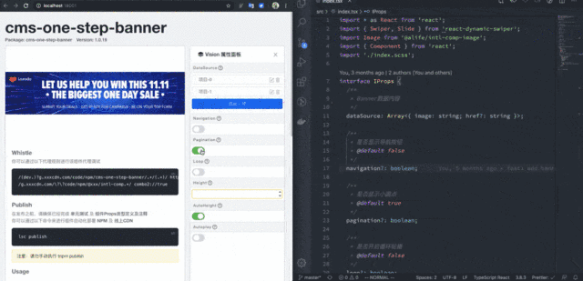

之前我们是借助了 webpack + TypeScript 做了一套用于开发 React 组件的脚手架套件，当开发者要组件开发时，即可直接使用脚手架初始化对应项目结构进行开发。

虽然主路径上确实解决了组件开发中所遇到的组件无图无真相、组件参数文档缺失、组件用法文档缺失、组件 Demo 缺失、组件无法索引、组件产物不规范等内部组件管理和沉淀上的问题，但 Webpack 的方案始终还是会让组件开发多一层编译，当一个组件库沉淀超过 300+ 时，引入依赖不断增长，还是会带来组件编译上的负荷导致开发者开发体验下降。

### 一 Vite 带来的曙光

Vite 给前端带来的绝对是一次革命性的变化，这么说毫不夸张。

或许应该说是 Vite 背后整合的 esbuild 、 Browser es modules、HMR、Pre-Bundling 等这些社区中关于 JS 编译发展的先进工具和思路，在 Vite 这样的整合推动下，给前端开发带来了革命性变化。

我很早就说过，任何一个框架或者库的出现最有价值的一定不是它的代码本身，而是这些代码背后所带来的新思路、新启发。所以我在写文章的时候，也很注重能把我思考最后执行的整个过程讲清楚。

Vite 为什么快，主要是 esbuild 进行 pre-bundles dependencies + 浏览器 native ESM 动态编译，这里我不做过多赘述，详细参考：Vite: The Problems

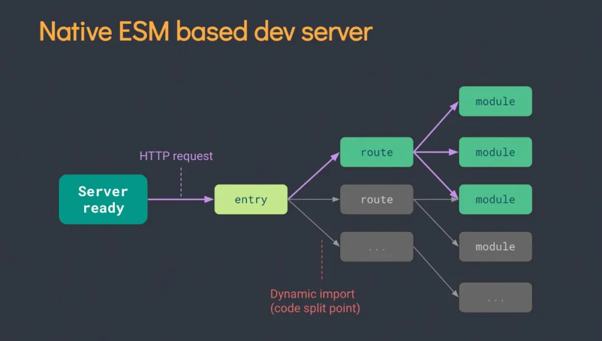

在这个思路的背景下，回到我们组件开发的场景再看会发现以下几个问题高度吻合：

*   组件库开发，实际上不需要编译全部组件。
*   组件开发，编译预览页面主要给开发者使用，浏览器兼容可控。
*   HMR（热更新）能力在 Vite 加持下更加显得立竿见影，是以往组件开发和调试花费时间最多的地方。
*   Vite 中一切源码模块动态编译，也就是 TypeScript 类型定义和 JS 注释也可以做到动态编译，大大缩小编译范围。

那么，以往像 StoryBook 和之前我们用于提取 tsx 组件类型定义的思路将可以做一个比较大的改变。

之前为了获取组件入参的类型数据会在 Wwebpack 层面做插件用于动态分析 export 的 tsx 组件，在该组件下动态加入一段 __docgenInfo 的静态属性变量，将从 AST 分析得到的类型数据和注释信息注入进组件 JS Bundle，从而进一步处理为动态参数设置：

TypeScript 对组件 Props 的定义

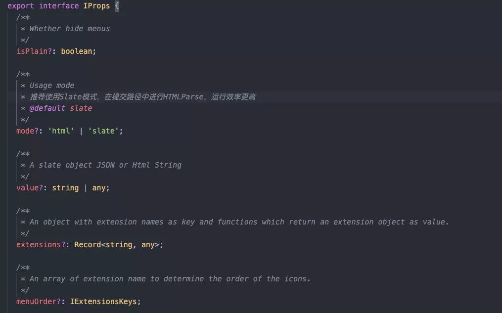

分析注入到 JS Bundle 中的内容

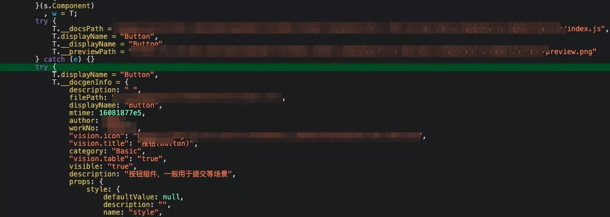

分析转换后实现的参数交互设置

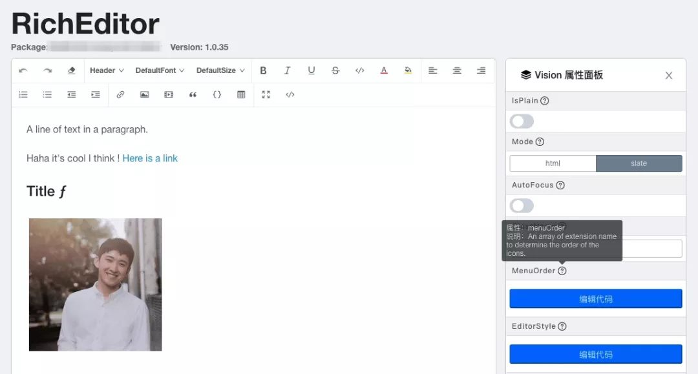

所以对于组件来说，实际上获取这一份类型定义的元数据对于组件本身来说是冗余的，不论这个组件中的这部分元数据有没有被用到，都会在 Webpack 编译过程中解析提取并注入到组件 Bundle 中，这显然是很低效的。

在 Vite 的思路中，完全可以在使用到组件元数据时，再获取其元数据信息，比如加载一个 React 组件为：

    import ReactComponent from './component1.tsx'

那么加载其元数据即：

    import ComponentTypeInfo from './component1.tsx.type.json';

    // or
    const ComponentTypeInfoPromise = import('./component1.tsx.type.json');

通过 Vite 中 Rollup 的插件能力加载 .type.json 文件类型，从而做到对应组件元数据的解析。同时借助 Rollup 本身对于编译依赖收集和 HMR 的能力，做到组件类型变化的热更新。

### 二 设计思路

以上是看到 Vite 的模块加载思路，得到的一些灵感和启发，从而做出的一个初步设想。

但如果真的要做这样一个基于 Vite 的 React 、 Rax 组件开发套件，除了组件入参元数据的获取以外，当然还有其他需要解决的问题，首当其冲的就是对于 .md 的文件解析。

#### 1 组件 Usage

参照 dumi 及 Icework 所提供的组件开发思路，组件 Usage 完全可以以 Markdown 写文档的形式写到任何一个 .md 文件中，由编译器动态解析其中关于 jsx、tsx、css、scss、less 的代码区块，并且把它当做一段可执行的 script 编译后，运行在页面中。

这样既是在写文档，又可以运行调试组件不同入参下组件表现情况，组件有多少中Case，可以写在不同的区块中交由用户自己选择查看，这个设计思路真是让人拍案叫绝！

最后，如果能结合上述提到 Vite 的 esbuild 动态加载和 HMR 能力，那么整个组件开发体验将会再一次得到质的飞跃。

所以针对 Markdown 文件需要做一个 Vite 插件来执行对 .md 的文件解析和加载，预期要实现的能力如下：

    import { content, modules } from "./component1/README.md";

    // content README.md 的原文内容
    // modules 通过解析获得的`jsx`,`tsx`,`css`,`scss`,`less` 运行模块

预期设想效果，请点击放大查看：

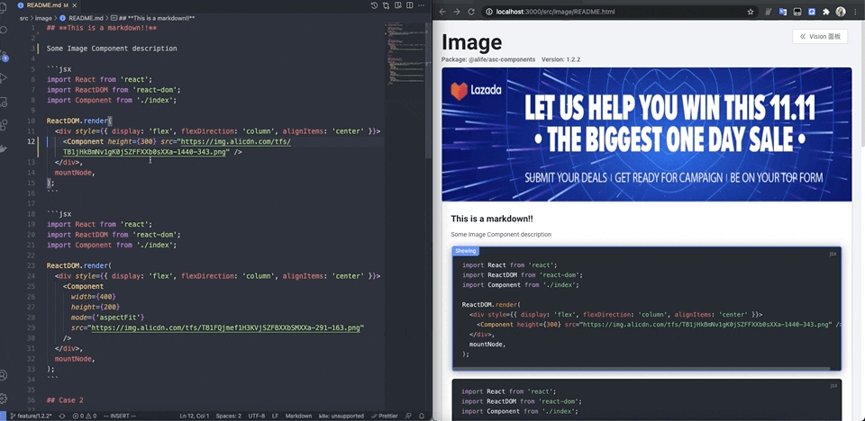

#### 2 组件 Runtime

一个常规的组件库目录应该是什么样的？不论是在一个单独的组件仓库，还是在一个已有的业务项目中，其实组件的目录结构大同小异，大致如下：

    components
    ├── component1
    │   ├── README.md
    │   ├── index.scss
    │   └── index.tsx
    ├── component2
    │   ├── README.md
    │   ├── index.scss
    │   └── index.tsx

在我们的设想中你可以在任意一个项目中启动组件开发模式，在运行 vite-comp 之后就可以看到一个专门针对组件开发的界面，在上面已经帮你解析并渲染出来了在 README.md 中编写的组件 Usage，以及在 index.tsx 定义的 interface，只需要访问不同的文件路径，即可查看对应组件的表现形态。

同时，最后可以帮你可以将这个界面上的全部内容编译打包，截图发布到 NPM 上，别人看到这个组件将会清晰看到其组件入参，用法，截图等，甚至可以打开 Demo 地址，修改组件参数来查看组件不同状态下的表现形态。

如果要实现这样的效果，则需要一套组件运行的 Runtime 进行支持，这样才可以协调 React 组件、README.md、TypeScript 类型定义串联成我们所需要的组件调试+文档一体的组件开发页面。

在这样的 Runtime 中，同样需要借助 Vite 的模块解析能力，将其 URL 为 _*/_/(README|*).html 的请求，转换为一段可访问的组件 Runtime Html 返回给浏览器，从而让浏览器运行真正的组件开发页面。

    http://localhost:7000/components/component1/README.html
    ->
    /components/component1/README.html
    ->
    /components/component1/README.md
    ->
    Runtime Html

#### 3 组件 Props Interface

正如我上述内容中讲到的，如果利用 Vite 添加一个对 tsx 的组件 props interface 类型解析的能力，也可以做成独立插件用于解析 .tsx.type.json 结尾的文件类型，通过 import 这种类型的文件，从而让编译器动态解析其 tsx 文件中所定义的 TypeScript 类型，并作为模块返回给前端消费。

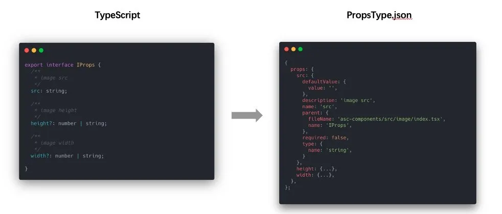

其加载过程就可以当做是一个虚拟的模块，可以理解为你可以通过直接 import 一个虚拟的文件地址，获取到对应的 React 组件元信息：

    // React Component
    import Component from './component1.tsx';
    // React Component Props Interface
    import ComponentTypeInfo from './component1.tsx.type.json';

    // or
    const ComponentTypeInfoPromise = import('./component1.tsx.type.json');

由于这种解析能力并不是借助于 esbuild 进行，所以在转换性能上无法和组件主流程编译同步进行。

在请求到该文件类型时，需要考虑在 Vite 的 Serve 模式下，新开线程进行这部分内容编译，由于整个过程是异步行为，不会影响组件主流程渲染进度。当请求返回响应后，再用于渲染组件 Props 定义及侧边栏面板部分。

在热更新过程中，同样需要考虑到 tsx 文件修改范围是否涉及到 TypeScript 类型的更改，如果发现修改导致类型变化时，再触发 HMR 事件进行模块更新。

### 三 组件 Build

以上都是在讨论组件在 Vite 的 Serve 态（也就是开发态）下的情况，我们上文中大量借助 Vite 利用浏览器 es module 的加载能力，从而做的一些开发态的动态加载能力的扩展。

但是 Vite 在组件最终 Build 过程中是没有 Server 服务启动，当然也不会有浏览器动态加载，所以为了让别人也可以看到我们开发的组件，能够体验我们开发时调试组件的样子，就需要考虑为该组件编译产出一份可以被浏览器运行的 html。

所以在 Vite 插件开发过程中，是需要考虑在 Build 状态下的编译路径的，如果是在 Build 状态下，Vite 将使用 Rollup 的编译能力，那么就需要考虑手动提供所有组件的 rollup.input(entries)。

在插件编写过程中，一定需要遵循 Rollup 所提供的插件加载生命周期，才能保证 Build 过程和 Serve 过程的模块加载逻辑和编译逻辑保持一致。

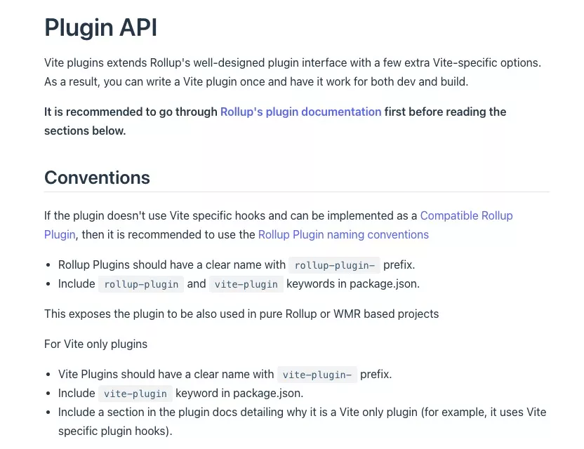

我一开始在实现的过程中，就是没有了解透彻 Vite 和 Rollup 的关系，在模块解析过程中依赖了大量 Vite 的 Server 提供的服务端中间件能力。导致在考虑到 Build 态时，才意识到其中的问题，最后几乎重新写了之前的加载逻辑。

### 四 总结

我姑且把这个方案（套件）称之为 vite-comp，其大致的构成就是由 Vite + 3 Vite Pugins 构成，每个插件相互不耦合，相互职责也不相同，也就是说你可以拿到任意一个 Vite 插件去做别的用途，后续会考虑单独开源，分别是：

*   Markdown，用于解析 .md 文件，加载后可获取原文及 jsx、tsx 等可运行区块。
*   TypeScript Interface，用于解析 .tsx 文件中对于 export 组件的 props 类型定义。
*   Vite Comp Runtime，用于运行组件开发态，编译最终组件文档。

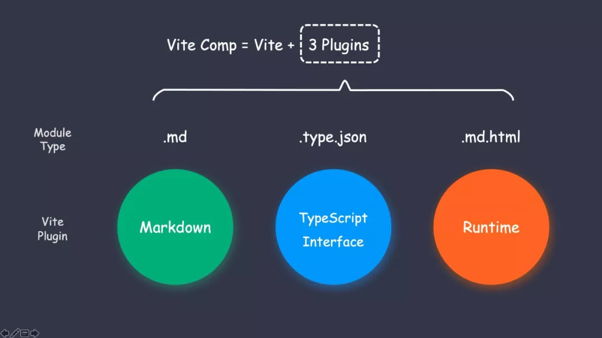

结合 Vite，已经实现了 Vite 模式下的 React、Rax 组件开发，它相比于之前使用 Webpack 做的组件开发，已经体现出了以下几个大优势：

*   无惧大型组件库，即使有 2000 个组件在同一个项目中，启动依旧是 <1000ms。
*   高效的组件元数据加载流，项目一切依赖编译按需进行。
*   毫秒级热更新响应，借助 esbuild 几乎是按下保存的一瞬间，就可以看到改动效果。

预览体验：

**启动**

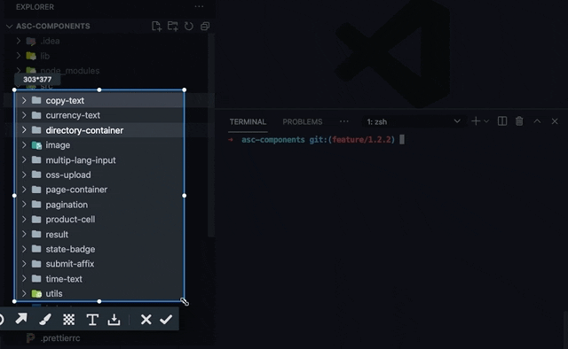

Markdown 组件文档毫秒级响应

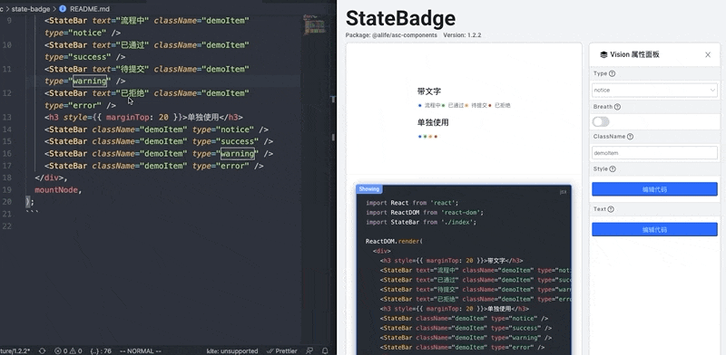

TypeScript 类型识别

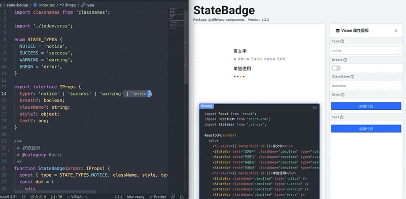

Vite 现在还是只是刚刚起步，这种全新的编译模式，已经给我带来了非常多的开发态收益，结合 Vite 的玩法未来一定还会层出不穷，比如 Midway + lambda + Vite 的前端一体化方案也是看得让人拍案叫绝，在这个欣欣向荣的前端大时代，相信不同前端产物都会和 Vite 结合出下一段传奇故事。

我是一个热爱生活的前端工程师！Yooh！

> 相关链接
> [https://vitejs.dev/guide/why.html#the-problems](https://vitejs.dev/guide/why.html#the-problems)
> [https://d.umijs.org/](https://d.umijs.org/)
> [https://ice.work/](https://ice.work/)

* * *

**前端开发技术图谱**

6 大知识点，14 个课程，680 个课时，将前端开发知识和实战经验融入图谱，包含 HTML 、CSS、JavaScript 、jQuery 、Vue 、React 、Angular 、NodeJS 等前端开发必备技能，帮你迅速提升。

[点击这里](https://developer.aliyun.com/graph/frontend?utm_content=g_1000278717)，开始学习吧~
