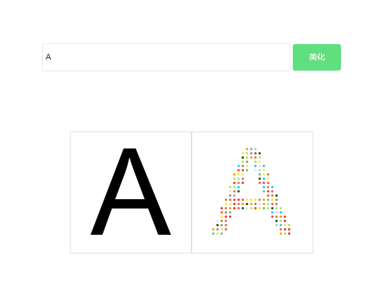
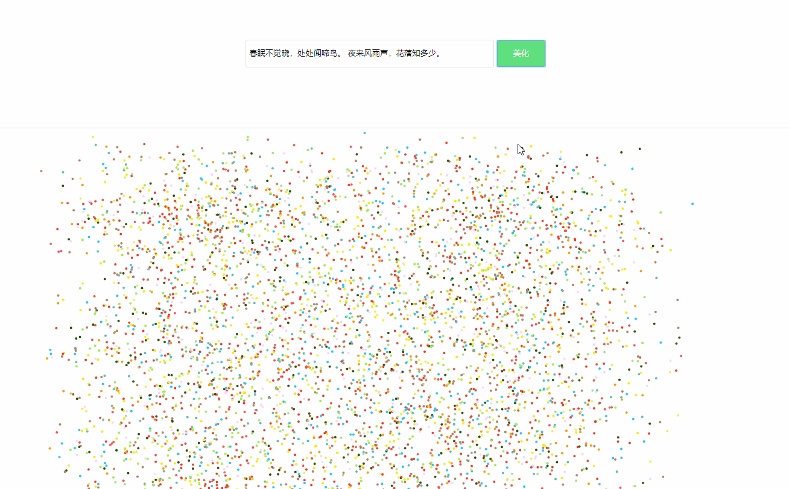

最近在学习canvas，对于canvas我本是是不太会的，仅会画个图片文字的，尴尬！！所以下个功夫学习下。

先看一个简单的例子：


<!--more-->

左边是通过canvas fillText API画出来的字，左边是根据右边的canvas用例子组成的。这种原理是过canvas的getImageData()方法获取canvas的像素点，再通过 Uint32Array 这个对象转成数组方便操作。

> Uint32Array表示一个由基于平台字节序的32位无符号字节组成的数组.如果需要对字节顺序进行控制(译者注:即 littleEndian 或 bigEndian),请使用DataView代替.数组中每个元素的初始值都是0.一旦创建，你可以用对象的方法引用数组里的元素，或者使用标准的数组索引语法（即，使用中括号）。

[Uint32Array MDN][fc240d1b]

  [fc240d1b]: https://developer.mozilla.org/zh-CN/docs/Web/JavaScript/Reference/Global_Objects/Uint32Array "Uint32Array MDN"


通过上述方法获取有效的像素点，用来生成例子文字

代码实现
```js
<!DOCTYPE html>
<html>

<head>
  <meta charset="utf-8">
  <title></title>
  <style media="screen">
    * {
      padding: 0;
      margin: 0;
    }
    .inp_text_a {
      height: 44px;
      line-height: 44px;
      border-radius: 4px;
      border: 1px solid #dddd;
      width: 400px;
      padding: 0 5px;
      outline: none;
    }
    .inp_btn_a {
      width: 80px;
      height: 44px;
      line-height: 44px;
      background: #5fdf7e;
      border-radius: 4px;
      border: none;
      color: #fff;
    }
  </style>
</head>

<body style="text-align: center">
  <div class="" style="width: 800px; margin: 100px auto;">
    <input type="text" name="" value="" class="inp_text_a" id="inp_text" placeholder="请输入文字"/>
    <input type="button" name="" value="美化" class="inp_btn_a" id="inp_btn" />
  </div>
  <script type="text/javascript">

    document.querySelector("#inp_btn").onclick = function () {
      let words = document.querySelector("#inp_text").value

      let wordsArr = words.split('')

      let canvas = document.querySelectorAll('canvas')
      let body = document.querySelector('body')
      for(let  i = 0; i < canvas.length; i ++) {
        body.removeChild(canvas[i])
      }

      for (let i = 0; i < wordsArr.length; i++) {
        draw(wordsArr[i])
      }
    }

    function draw (words) {
      let canvas = document.createElement('canvas')
      let ctx = canvas.getContext('2d')

      canvas.width = 400 / 2
      canvas.height = 400 / 2

      ctx.textAlign = "center"
      ctx.font = "200px arial"
      ctx.fillText(words, 200 / 2, 350 / 2 - 5)
      drawColors(ctx, canvas)
    }

    function drawColors (ctx, canvas) {
      let gridY = 7,
        gridX = 7;


      var idata = ctx.getImageData(0, 0, canvas.width, canvas.height);
      var buffer32 = new Uint32Array(idata.data.buffer);

      var canvas_new = document.createElement('canvas')
      var context = canvas_new.getContext('2d')
      canvas_new.width = canvas.width
      canvas_new.height = canvas.height

      for (var j = 0; j < canvas.height; j += gridY)
      {
        for (var i = 0; i < canvas.width; i += gridX)
        {
          if (buffer32[j * canvas.width + i])
          {
            var particle = drawArc(context, i, j);
          }
        }
      }
      document.querySelectorAll('body')[0].appendChild(canvas)
      document.querySelectorAll('body')[0].appendChild(canvas_new)
    }

    function drawArc(context, x, y)
    {
      let colors = ["#feea00", "#a9df85", "#5dc0ad", "#ff9a00", "#fa3f20", "#e03636", "#25c6fc", "#ff534d", "#b78261", "#b78261", "#eaf048", "#9ff048", "#2a5200", "#f6d6ff"]
      context.beginPath();
      context.arc(x, y, 2, 0, 2 * Math.PI);
      context.fillStyle = colors[getRandom(0, colors.length - 1)];
      context.fill();
      context.closePath();
    }

    function getRandom(min, max)
    {
      return Math.floor((Math.random() * (max - min + 1) + min))
    }
  </script>
</body>

</html>
```

当然这只是静态的，没加任何效果的。但是原理都是一样的，知道了原理，都是万变不离其宗的。接下来只是在原来的基础上加上动画了。

代码实现如下，大部分代码都有注释的：

```js
/**
 * canvas 粒子文字
 */

class WordsCanvas {
  constructor (canvas, options = {}) {
    this.canvas = canvas ? (typeof canvas == 'object' ? canvas : document.querySelector(canvas)) : document.createElement('canvas')

    this.data = {}
    this.ctx = this.canvas.getContext('2d')
    this.particles = []
    this.init(options)
    this.lock = true
  }

  init (options) {
    let defaultConfig = {
      colors: ["#feea00", "#a9df85", "#5dc0ad", "#ff9a00", "#fa3f20", "#e03636", "#25c6fc", "#ff534d", "#b78261", "#b78261", "#eaf048", "#9ff048", "#2a5200", "#f6d6ff"],
      r: 2,
      wordWidth: 0,
      gridY: 7, // 间隔像素点
      gridX: 7, //间隔像素点
    }

    this.data = Object.assign({}, defaultConfig, options)
  }

  render (words) {

    this.ctx.textAlign = "center"
    this.ctx.textBaseline = "middle";
    this.ctx.font = "200px Arial"
    let wordWidth = this.ctx.measureText(words).width

    if (wordWidth > window.innerWidth) {
      let rows = Math.ceil(wordWidth / window.innerWidth)
      this.canvas.width = window.innerWidth
      this.canvas.height = 200 * rows
    } else{
      this.canvas.width = 200 * words.length
      this.canvas.height = 200
    }

    this.cw = this.canvas.width
    this.ch = this.canvas.height

    this.ctx.clearRect(0 , 0, this.cw, this.ch)
    this.ctx.textAlign = "center"
    this.ctx.textBaseline = "middle"
    this.ctx.font = "200px Arial"
    // this.ctx.fillText(words, (this.cw - wordWidth ) / 2 + wordWidth / 2, 200 / 2, this.cw)
    this.renderWords(words, (this.cw - wordWidth ) / 2 + wordWidth / 2, 200 / 2, this.cw)
    let imgData = this.ctx.getImageData(0, 0, this.cw, this.ch)

    this.ctx.clearRect(0 , 0, this.cw, this.ch)
    this.createParticle(imgData)
  }

  /**
   * 随机返回一个颜色
   * @return {[type]} [description]
   */
  getRandomColor () {
    return this.data.colors[this.getRandom(0, this.data.colors.length - 1)]
  }

  /**
   * 创建粒子集合
   * @param  {[type]} imgData [description]
   * @return {[type]}         [description]
   */
  createParticle (imgData) {
    let buffer32 = new Uint32Array(imgData.data.buffer)

    for (var j = 0; j < this.ch; j += this.data.gridY)
    {
      for (var i = 0; i < this.cw; i += this.data.gridX)
      {
        if (buffer32[j * this.cw + i])
        {
          var part = this.particle(i, j, this.data.r, this.getRandomColor(), this.cw, this.ch)
          this.renderParticle(part)
          this.particles.push(part)
        }
      }
    }
    this.animation()
  }

  /**
   * 动画执行函数
   * @return {[type]} [description]
   */
  animation () {
    let that = this
    let thisTIme = new Date()
    let animTime = null
    doAnimation()
    let pause = false

    function doAnimation(time) {
      that.ctx.clearRect(0, 0, that.cw, that.ch)
      that.particles.forEach(item => {
        if(that.lock){
          if(Math.abs(item.targetX-item.x) < 0.01 && Math.abs(item.targetY-item.y) < 0.01){
            item.x = item.targetX
            item.y = item.targetY
            pause = true
            if(thisTIme - animTime > 300) that.lock = false
          } else{
            item.x += (item.targetX - item.x) * 0.2
            item.y += (item.targetY - item.y) * 0.2
            animTime = new Date()
          }
        }else{
          console.log(2);
          if(Math.abs(item.initX-item.x) < 0.01 && Math.abs(item.initY-item.y) < 0.01){
            item.x = item.initX
            item.y = item.initY
            pause = true
            console.log("执行完毕！")
          } else{
            item.x += (item.initX-item.x) * 0.01
            item.y += (item.initY-item.y) * 0.01
            pause = false
          }
        }
        that.renderParticle(item)
      })
      if(!pause) {
        window.requestAnimationFrame(doAnimation)
      }
    }
  }

  /**
   * 画文字
   * @param  {[type]} t [description]
   * @param  {[type]} x [description]
   * @param  {[type]} y [description]
   * @param  {[type]} w [description]
   * @return {[type]}   [description]
   */
  renderWords (t, x, y, w) {
    t = t.replace(/\s/g,"");
    let textArr = t.split('')
    let cw = this.cw
    let texts = []
    // 一行的字数
    let temp = []
    let textNumber = Math.floor(cw / 200)
    textArr.forEach((v, i) => {
      let row = Math.floor(i / textNumber)
      if (texts[row]) {
        texts[row].push(v)
      } else {
        texts[row] = []
        texts[row].push(v)
      }
    })

    texts.forEach((v, i) => {
      this.ctx.fillText(v.join(''), x, y + (i * 200), cw)
    })
  }
  /**
   * 渲染单个粒子
   * @param  {[type]} particle [description]
   * @return {[type]}          [description]
   */
  renderParticle (particle) {
    this.ctx.save()
    this.ctx.fillStyle = particle.color
    this.ctx.beginPath()
    this.ctx.arc(particle.x, particle.y, particle.r, 0, 2 * Math.PI, true)
    this.ctx.closePath()
    this.ctx.fill()
    this.ctx.restore()
  }

  getRandom(min, max) {
    return Math.floor((Math.random() * (max - min + 1) + min))
  }

  /**
   * 粒子构造函数
   * @param  {Number} x  [x坐标]
   * @param  {Number} y  [y坐标]
   * @param  {Number} r  [半径]
   * @param  {Number} cw [canvas宽]
   * @param  {Number} ch [canvas高]
   * @return {Object}    [粒子对象]
   */
  particle (x, y, r, color, cw, ch) {
    let initx = Math.random() * cw
    let inity = Math.random() * ch
    return {
      targetX: x,
      targetY: y,
      color: color,
      initX: initx,
      initY: inity,
      x: initx,
      y: inity,
      r: r,
    }
  }
}
module.exports = WordsCanvas;
```

调用方式

```js
let a = new WordsCanvas(document.querySelector("#canvasWords"), {})
  a.render('A')
```

最终实现的效果如下:



最后奉上github地址: [https://github.com/CavinHuang/canvas-study-demo/tree/master/app/templates/canvas-word](https://github.com/CavinHuang/canvas-study-demo/tree/master/app/templates/canvas-word)
